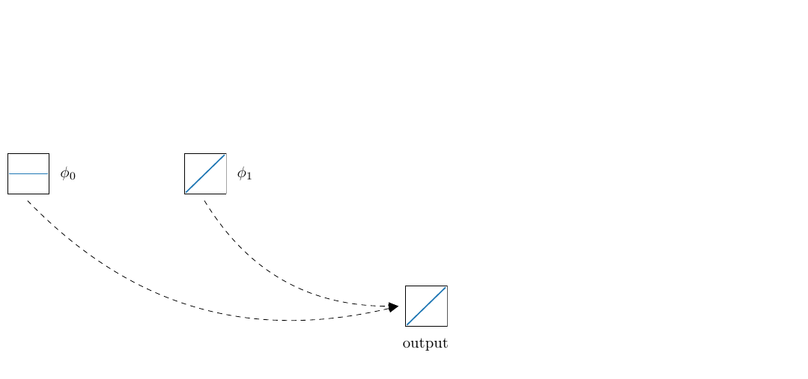
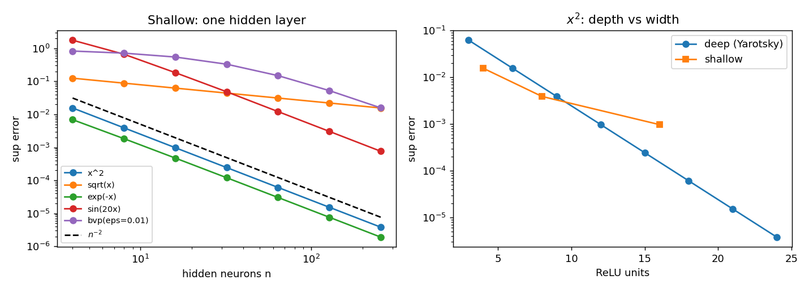
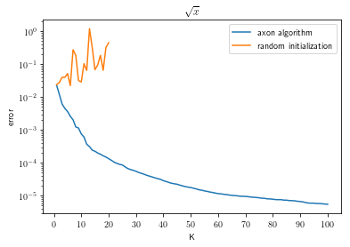
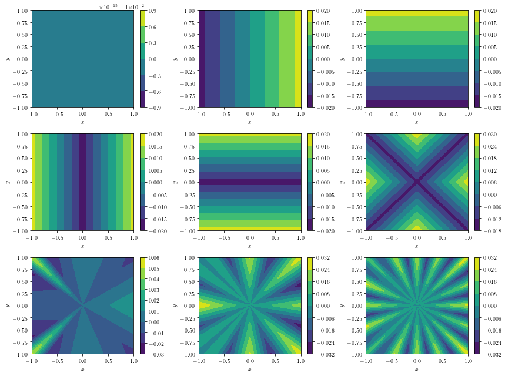

# nnapprox

[](https://github.com/Muhammadhammad24/nnapprox/actions/workflows/ci.yml)

**Function approximation with deep ReLU networks.** A research project
(Neural Network Approximation, 2024) that reproduces and compares two
constructive approaches to approximating functions on $[0,1]$ and $[0,1]^2$:

1. **Optimal ReLU approximation.** Liu and Liang show error rates for convex
   $f$ in terms of network depth and width [[1]](#references).
2. **Greedy "growing axons".** Fokina and Oseledets add neurons one at a time,
   each chosen by optimising a projection objective, and keep the basis
   orthogonal [[2]](#references).

By Muhammad Hammad and Sharareh Sayyad.

<p align="center">
  
</p>

## Constructive baselines

Before training anything, [`src_nna/constructive`](src_nna/constructive) builds
ReLU networks in closed form with known error guarantees. Learned methods are
measured against these:

- **Shallow:** one hidden layer that exactly reproduces the piecewise-linear
  interpolant on $n$ intervals, using $n$ neurons.
- **Deep:** Yarotsky's network for $x^2$, built from composed hat functions
  [[4]](#references). The error is $2^{-2m-2}$ at depth $m$ and three ReLUs per level.

```bash
python -m src_nna.constructive.rates --plot docs/rates.png
```

| Target | n = 16 | n = 64 | n = 256 | Observed order |
| --- | --- | --- | --- | --- |
| $x^2$ | 9.8e-4 | 6.1e-5 | 3.8e-6 | $n^{-2.00}$ |
| $e^{-x}$ | 4.7e-4 | 3.0e-5 | 1.9e-6 | $n^{-1.97}$ |
| $\sin(20x)$ | 1.8e-1 | 1.2e-2 | 7.6e-4 | $n^{-1.89}$ |
| $\sqrt{x}$ | 6.3e-2 | 3.1e-2 | 1.6e-2 | $n^{-0.50}$ |
| BVP, $arepsilon=0.01$ | 5.5e-1 | 1.5e-1 | 1.6e-2 | $n^{-0.95}$ |

Smooth targets reach the theoretical $O(n^{-2})$. The singular $\sqrt{x}$ and
the boundary-layer problem do not, because a uniform grid wastes neurons where
the function is flat. That gap is what adaptive methods such as Axon are meant
to close. Depth pays off too: 24 ReLUs arranged in 8 levels approximate $x^2$
to $3.8	imes10^{-6}$, which one hidden layer only reaches with 256 neurons.

<p align="center">
  
</p>

## Greedy Axon results

The greedy Axon construction against the same architecture trained from random
initialisation, for $f(x)=\sqrt{x}$. The greedy basis keeps converging past
$10^{-5}$, while random initialisation stalls and becomes unstable after about
ten neurons.

<p align="center">
  
</p>

The first nine basis functions learned for the 2-D target
$f(x,y)=\sqrt{x^2+y^2}$:

<p align="center">
  
</p>

The full set of experiments is in
[`experiments.ipynb`](src_nna/axon_approx/pytorch/experiments.ipynb):
$x^2$, $\sqrt{x}$, $e^{-x}$, $\sin(20x)$, a singularly perturbed boundary-value
problem $-\varepsilon^2u''+u=1$, and the 2-D cone.

## Getting started

```bash
python -m venv .venv && source .venv/bin/activate
pip install -r requirements.txt
pip install -e .
jupyter notebook src_nna/axon_approx/pytorch/examples.ipynb
```

Train a randomly initialised baseline from the command line:

```bash
cd src_nna/axon_approx/pytorch
python train_random.py --help
```

## Layout

```
src_nna/constructive/          closed-form ReLU networks and the rate study
src_nna/axon_approx/pytorch/   Axon algorithm, model, baselines and notebooks
functions/univariate/          1-D targets, including the exact BVP solution
functions/bivariate/           2-D targets
tests/                         error-bound, construction and target tests
docs/                          figures used in this README
```

## Tests

```bash
pip install -e . pytest
pytest
```

The tests check the theory, not just that the code runs. They cover the
$h^2/4$ interpolation error for $x^2$, Yarotsky's bound at every depth up to 8,
second-order convergence on a smooth target, and the BVP solution against its
ODE and boundary conditions.

## Roadmap

- [x] Reproduce the Axon results as a baseline (1-D and 2-D)
- [x] Closed-form shallow and deep ReLU baselines with measured error rates
- [ ] Implement the optimal construction of [1] for convex targets and compare with Axon
- [ ] Port both methods to JAX and benchmark against PyTorch
- [ ] Physics-informed variants that use the governing equation as a regulariser
- [ ] Written report

## Attribution

The code in [`src_nna/axon_approx/pytorch`](src_nna/axon_approx/pytorch) is
taken from the authors' reference implementation,
[dashafok/axon-approximation](https://github.com/dashafok/axon-approximation),
and is used here as the baseline for comparison. See
[`UPSTREAM.md`](src_nna/axon_approx/pytorch/UPSTREAM.md). The MIT license in
this repository covers the original work only.

## References

1. B. Liu, Y. Liang. _Optimal function approximation with ReLU neural
   networks._ Neurocomputing 435 (2021).
   [doi:10.1016/j.neucom.2021.01.007](https://www.sciencedirect.com/science/article/pii/S0925231221000151)
2. D. Fokina, I. Oseledets. _Growing axons: greedy learning of neural networks
   with application to function approximation._ Russian Journal of Numerical
   Analysis and Mathematical Modelling 38 (2023).
   [arXiv:1910.12686](https://arxiv.org/abs/1910.12686)
3. M. Raissi. _Open Problems in Applied Deep Learning._
   [arXiv:2301.11316](https://arxiv.org/abs/2301.11316) (2023).
4. D. Yarotsky. _Error bounds for approximations with deep ReLU networks._
   Neural Networks 94 (2017). [arXiv:1610.01145](https://arxiv.org/abs/1610.01145)
